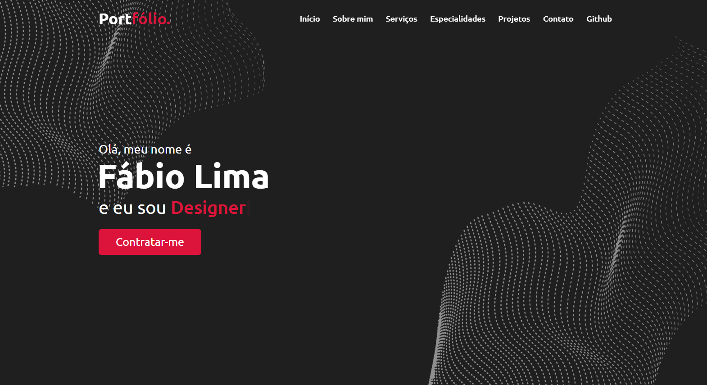

# Portifolio Principal!

Acesse o projeto <a href="https://limadev-max.github.io/Novo-Portifolio-update/">aqui</a>.

## Linguagens Utilizadas
  
  HTML

  
 CSS

  
 JavaScript

## Minhas Redes Sociais!

 

Acesse outros Projetos <a href="https://github.com/LimaDev-Max?tab=repositories" target="_blank">aqui</a>.

## Layout 

  

    

 
